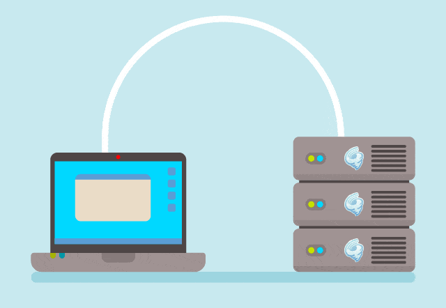

# Web Server
  
 
A Web Server is a hardware & software that uses [http](https://developer.mozilla.org/en-US/docs/Web/HTTP/Overview) and other protocols to respond to a client requests made over the network or World Wide Web(WWW).  

As a hardware, a web server is a computer that holds web server software and other files related to the website or web service such as HTML documents, images, javascript files, etc.
This computer is connected to the internet/network and allows data to be exchanged with the other connected devices.  

As a software, a web server controls how a user accesses the hosted file. It access a domain names website or IP address and ensures the delivery of the content to the requesting user.  
