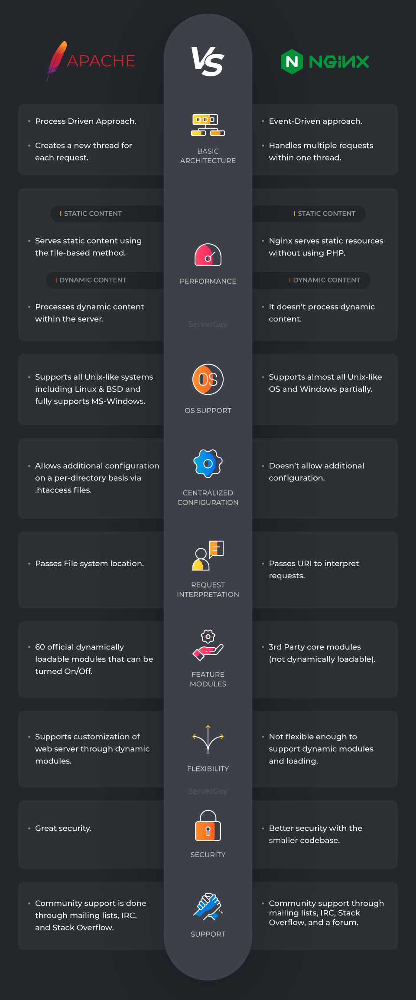
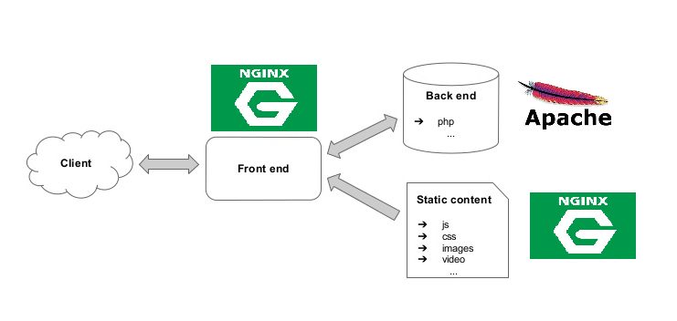

###### NGINX

*Short tagline*

[[toc]]

## Introduction
**NGINX** (pronounced __Engine X__) is a free, open source, high-performance HTTP server and reverse proxy as well as an [IMAP/POP3](https://help.aol.com/articles/what-is-the-difference-between-pop3-and-imap) proxy server.
It's known for its high performance, stability, rich feature set, simple configuration.  

NGINX is one of the handful of servers written to address the [C10K problem](http://www.kegel.com/c10k.html#top) , a term coined in 1999 to describe the difficulty that existing web servers experienced 
in handling large numbers (the 10K) of concurrent connections (the C).  

Unlike traditional servers, NGINX doesn't rely on threads to handle requests. Instead it uses much more scalable [even-driven](https://en.wikipedia.org/wiki/Event-driven_architecture) asynchronous architecture.
This architecture uses small, but more importantly, predictable amounts of memory under load. NGINX revolutionized how server operate in [high performance context](https://www.nginx.com/blog/inside-nginx-how-we-designed-for-performance-scale/)  and became the fastest web server available. 
 
  
## Key Features
  - Load Balancer - Extend traditional load balancing with software:
    - HTTP/TCP/UDP support
    - [Layer 7 request routing](https://nginx.org/en/docs/http/ngx_http_core_module.html?&_ga=2.131816582.863585722.1590649299-582712121.1590649299#location)
  - Content Cache - Use the same cache that powers the world's largest CDNs.
    - Static and dynamic content caching
  - Web Server and Reverse Proxy - Deliver static assets with unparallelled speed and efficiency.
    - Origin server for static content
    - Reverse proxy: HTTP, FastCGI, memcached, SCGI, uwsgi
    - [HTTP/2 gateway](https://nginx.org/en/docs/http/ngx_http_v2_module.html?_ga=2.131816582.863585722.1590649299-582712121.1590649299)
    - gRPC proxy
    - HTTP/2 server push
  - Security controls - Protect your applications: 
    - [HTTP Basic Authentication](https://nginx.org/en/docs/http/ngx_http_auth_basic_module.html?_ga=2.72642714.863585722.1590649299-582712121.1590649299)
    - [HTTP authentication subrequests](https://nginx.org/en/docs/http/ngx_http_auth_request_module.html?_ga=2.72642714.863585722.1590649299-582712121.1590649299)
    - [IP address‑based access control lists](https://nginx.org/en/docs/http/ngx_http_access_module.html?_ga=2.126702724.863585722.1590649299-582712121.1590649299)
    - [Rate limiting](https://www.nginx.com/blog/rate-limiting-nginx/)
    - Dual‑stack RSA/ECC SSL/TLS offload
    - TLS 1.3 support
  - Monitoring - Diagnose and debug complex application architectures:
    - AppDynamics, Datadog, Dynatrace plug‑ins
  - Programmability - Dynamically deploy custom architectures:
    - [NGINX JavaScript module](https://www.nginx.com/blog/introduction-nginscript/)
  - Streaming media - Scalably deliver streaming media:
    - Live streaming: RTMP, HLS, DASH
    - VOD: Flash (flv), MP4
  - Third-party ecosystem
    - [Kubernetes Ingress controller](https://www.nginx.com/products/nginx/kubernetes-ingress-controller)
    - OpenShift Router
    
## NGINX vs Apache
The Apache HTTP server and NGINX are the two most popular open source web servers use to deliver web pages to a user's web browser
  
        

### Features Comparison
|      CATEGORY            |       APACHE VS NGINX                        | 
| :------------------------| :------------------------------------------:|
|  Architecture            | NGINX has a lightweight structure, much faster architecture than Apache |
|  Performance             | As far as _**Static content**_ is concerned, NGINX overpasses Apache, for _**Dynamic content**_, both are great at processing |
|  OS Support              | Apache comes out the winner since it runs on all kinds of Unix-like systems (e.g., Linux or BSD) and has full support for Microsoft Windows. |
|  Distributed / Centralized Configuration | Apache if configuration is considered; NGiNX if speed is. |
|  Request Interpretation  | Nginx has won because of its quicker interpretation and response. |
|  Feature Modules         | NGiNX is less yet important features and modules make it lighter, smarter and better web server than Apache. |
|  Flexibility             | Apache is clearly lead on this point since it supports customization of web server through dynamic modules.|  
|  Security                | Both of them are secured, but NGINX has a better security with smaller codebase |
|  Support                 | It’s a tie! The support is almost same in both. Both web servers are great. |

### Comparison Summary
|      APACHE                         |       NGINX                                    | 
| :-----------------------------------| :---------------------------------------------:|
| Is designed to be a web server      | Is both a web server and reverse proxy server  |
| Cannot process multiple requests concurrently with heavy web traffic. | Can process multiple client requests concurrently with limited resources | 
| Has a multi-threaded approach to process client requests. | Has an even-driven approach to serve client requests |
| Modules are dynamically loaded or unloaded making it more flexible | Modules cannot be loaded dynamically. Must be compiled within the core software. |
| Handles dynamic content within the web server itself | Cannot process dynamic content natively. |

## Use Cases
### When Choose NGINX over Apache?
 
 -  Fast Static Content Processing  
 >  NGINX can perform a much better job at handling the static files from a specific directory.  
 Also, the upstream server processes don’t get blocked because of the heavy, multiple static content requests as Nginx can process them concurrently. This significantly improves the overall performance of backend servers.
  

 - Great for High Traffic Websites
 > If we talk about the speed and how many clients can be served on a high load, Nginx will always shine as a winner over Apache.
 >   This makes Nginx significantly lightweight and great for server resources. This is why most of the web developers prefer Nginx over Apache.
 >    In a nutshell, when it comes to serving a website with a large volume of traffic, there is no beating Nginx.
 
### When Choose Apache over NGINX?

 - Apache .htaccess
 > NGINX does not support something like the Apache’s .htaccess file. However, with Apache, you get an advantage to give the non-privileged users control over some important aspects of their website.
 > - The users, obviously, are not permitted to edit the main configuration.
 > - Using .htaccess files, you can override system-wide settings on a per-directory basis.
 > - For optimal performance, include these .htaccess directives in the main configuration file(s).
 > - In a shared hosting environment, Apache works better because of its .htaccess configuration.
 >   **PS** For dedicated hosting or VPS Nginx stays the best option.

 - In case of functionality limitations – use Apache
 > Nginx has some core modules that are very important. Howbeit, there are some functionality limitations with Nginx.
 >     In case of some limitations or needing to use extra modules that are not supported by Nginx, you might want to choose Apache instead.

### Or, Use Both of them -Together!
Yes, Apache and Nginx can be friends too!  
It is possible to use each server’s strengths by using them together.  
You can use Nginx in front of Apache as a server proxy (as shown in the image below). This takes advantage of Nginx fast processing speed and ability to establish large no, of connection simultaneously.

For static connections, Nginx will serve the files quickly to the clients. For dynamic content, for example, Php files, Nginx reverse proxy server will proxy their request to Apache which can then process their results and return their rendered page.  
Nginx can then pass the final content to the client. Also, it allows you to have a very functional webserver to serve your clients (the large volume of users) very fast.  

## References   
 - [2016 Web Server Benchmarks performance](https://www.rootusers.com/linux-web-server-performance-benchmark-2016-results/)
 - [NGINX Performance & Scale](https://www.nginx.com/blog/inside-nginx-how-we-designed-for-performance-scale/)
 - [NGINX BLOG](https://www.aosabook.org/en/nginx.html)
